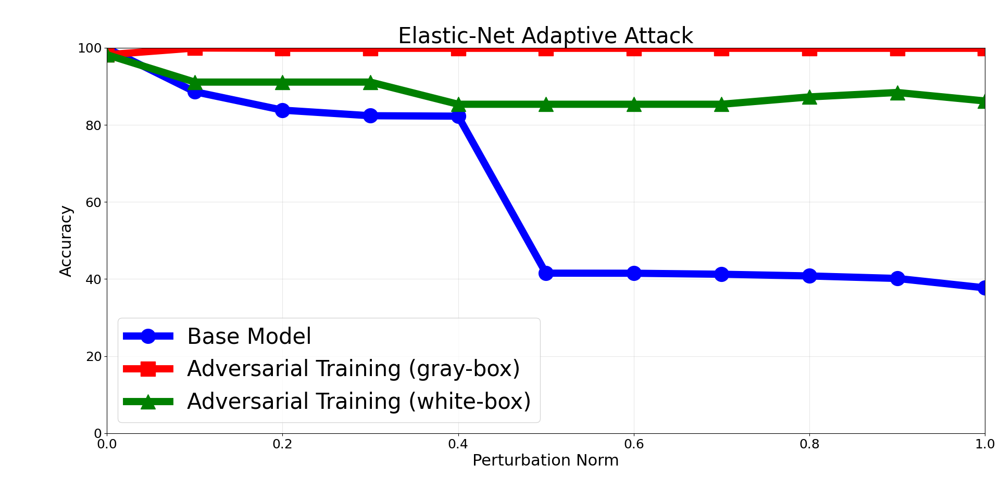
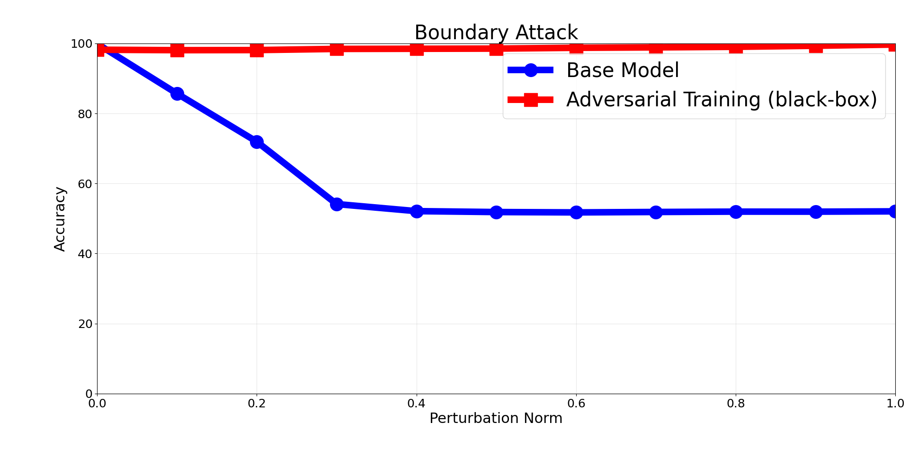

# DDoS Adversarial Attacks Detection with DNNs in P4 Programmable Switches

Reproduction code for the paper:

> **G. Zingrillo, L. Ismail, E. Paolini, F. Paolucci, F. Cugini, L. De Marinis,**
> *"DDoS Adversarial Attacks Detection with Deep Neural Networks in P4 Programmable
> Switches"*, **EuCNC**.

This work builds an **in-switch, DNN-based NIDS** that is resilient to adversarial
attacks. Alongside the primary **Attack Detector**, we train and deploy a dedicated
**Adversarial Detector** (via *adversarial training*). Both detectors are
**LUT-distilled** onto an **Intel Tofino** P4 switch and run in parallel, their outputs
combined with a logical OR. The framework keeps robust accuracy between **91% and 99%**
across white-, gray- and black-box threat models, adding only **1–2 µs** of latency over
plain forwarding.

- **Dataset:** Edge-IIoTset (14 threat categories; binary benign/malicious task)
- **Features (4 TCP):** `tcp.flags`, `tcp.data_offset`, `tcp.seq`, `tcp.ack` — selected
  from 46 candidates by **chi-square** analysis under P4-extractability and
  cross-domain-robustness constraints
- **Model:** two DoReFa 8-bit quantized 2-input subnetworks → final stage → binary
  softmax, distilled into a **3-tier LUT hierarchy** (LUT1, LUT2 → LUT3)

## Key result

The undefended model collapses to ~40% (EAD) / ~52% (Boundary) under attack, while the
adversarially-trained detector stays **>98%** in gray-/black-box and **85–91%** under a
white-box EAD attack.

| | EAD (white-/gray-box) | Boundary (black-box) |
|---|---|---|
| With Adversarial Detector |  |  |

Hardware validation on Tofino: software accuracy **81.24%** vs compiled-P4 **81.15%**
on ~485k packets (≤0.1 pp deviation).

## Repository structure

```
modelliScript/        # DNN definitions (binary detector + randomized/adversarial variant)
packetManagement/     # Edge-IIoTset feature extraction, csv <-> pcap conversion
datiPerPaper/         # per-figure result curves (adversarial training, randomized, reduction)
docs/figures/         # rendered result figures
p4/                   # P4/Tofino data-plane pipeline — description (see p4/README.md)
utils.py              # scaling / normalization helpers
feature_selection.py  # chi-square feature ranking on Edge-IIoTset
addestraModelloBinarioCompleto.py        # train the (quantized) detector
EADAttack.py / EADArtScaler.py           # EAD white-box attack (foolbox / ART)
boundaryAttack.py / boundaryART.py       # Boundary black-box attack (foolbox / ART)
generateEADAdversarial.py                # craft the adversarial-training corpus
convert*ToPcap.py / createDatasetFromPcap.py / AdversarialLookupFromPcap.py
                      # consistent adversarial-packet generation + pcap reconstruction
LUT*.py               # LUT distillation + software LUT simulator
generaGraficiPaper.py / performancePlotter.py   # plotting
```

## Setup

```bash
python -m venv .venv && source .venv/bin/activate    # Windows: .venv\Scripts\activate
pip install -r requirements.txt   # Python 3.10
```

## Data (not included)

The Edge-IIoTset captures, serialized `.hkl` datasets, trained `.h5` models and the
large LUT csv tables are **not committed**. Download Edge-IIoTset from its official
source (Ferrag et al., 2022) and place the `DNN-EdgeIIoT-dataset.csv` under
`Edge-IIoTset dataset/Selected dataset for ML and DL/` (the path expected by
`feature_selection.py`), then regenerate artifacts with the workflow below.

## Reproducing the paper

### Figures from committed results (no GPU needed)
```bash
python generaGraficiPaper.py     # EAD/Boundary curves: base vs adversarial-training defense
```
This reads the per-figure curves in `datiPerPaper/` (`*_adv_training.csv`,
`*_randomized.csv`, `*_precision_reduction.csv`).

### Full pipeline
```bash
python feature_selection.py                  # chi-square feature ranking
python packetManagement/"Edge-IIoT extractor.py"   # build the feature dataset
python addestraModelloBinarioCompleto.py     # train the Attack Detector
python generateEADAdversarial.py             # craft EAD adversarial corpus (eps 0.25 / 0.5)
python addestraModelloBinarioCompleto.py     # train the Adversarial Detector (adversarial training)
python EADAttack.py                          # white-/gray-box evaluation
python boundaryAttack.py                     # black-box evaluation
python LUTOptimizedGenerator.py              # distil detectors into LUT tables for the switch
```

The consistent-adversarial-packet tooling (`convert*ToPcap.py`,
`createDatasetFromPcap.py`, `AdversarialLookupFromPcap.py`) rebuilds protocol-valid
`.pcap` traces from adversarial feature vectors, used for the Tofino hardware test.

## P4 / Tofino data plane

The switch-side P4 program (parser → LUT1/LUT2/LUT3 match-action tables → forwarding)
is **not included** in this repository (it was developed/run on the Tofino testbed). See
[`p4/README.md`](p4/README.md) for the pipeline description and the LUT entry format
produced by `LUT*.py`.

## Acknowledgements

Funded by the European Commission Horizon Europe SNS JU **NATWORK** project (g.a. No.
101139285). Carried out at CNIT and Scuola Superiore Sant'Anna, Pisa.

This repository is part of a broader research internship — see
[`cnit-internship-inswitch-nids`](https://github.com/giuliozing/cnit-internship-inswitch-nids).

## License

Code released under the [MIT License](LICENSE). The Edge-IIoTset dataset remains under
its own license and must be obtained from the official source.
